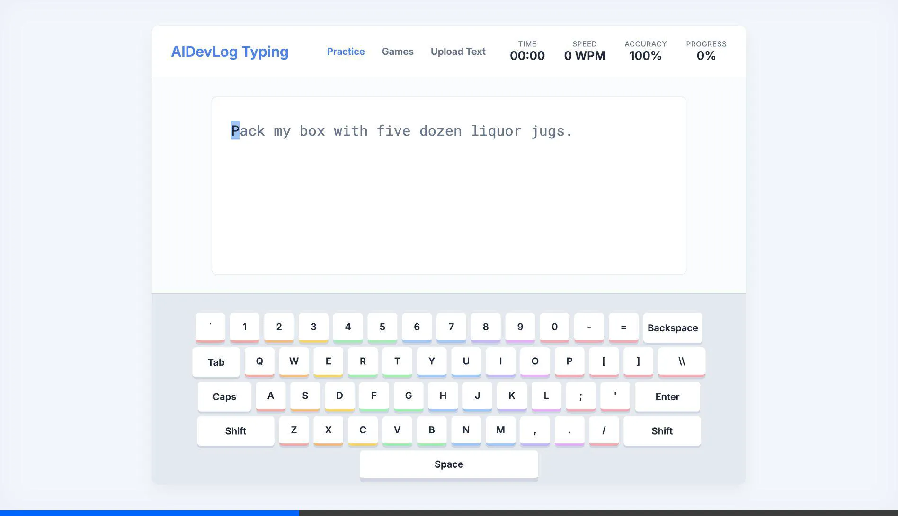
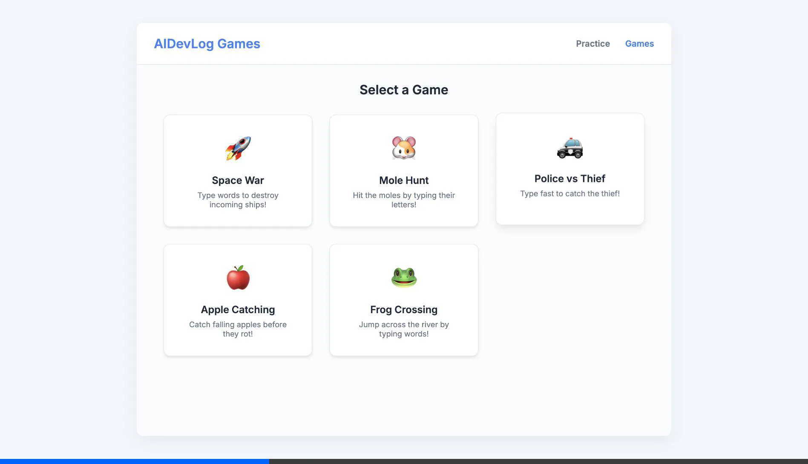

# AIDevLog Typing (Kingsoft Typing Clone)

<https://github.com/build-your-own-x-with-ai/AITyping>

A modern, web-based typing practice application inspired by "AIDevLog Typing" (TypeEasy). Built with vanilla HTML, CSS, and JavaScript.

## Features

### 🎯 Practice Mode
- **Real-time Feedback**: Instant visual cues for correct/incorrect keystrokes.
- **Statistics**: Live tracking of WPM (Words Per Minute), Accuracy, Time, and Progress.
- **Virtual Keyboard**: Visual keyboard with active key highlighting and **Hand Placement Guide** (color-coded finger zones).
- **Particle Effects**: Satisfying spark effects on correct keystrokes.
- **Custom Text**: Upload your own `.txt` files to practice custom content.

### 🎮 Game Center
Includes 5 engaging typing games to make practice fun:

1.  **Space War**: Destroy incoming ships by typing their words. Features laser and explosion effects.
2.  **Mole Hunt**: Whack moles by typing the characters they hold.
3.  **Police vs Thief**: Type fast to help the police car catch the thief.
4.  **Apple Catching**: Catch falling apples before they rot.
5.  **Frog Crossing**: Help the frog jump across the river by typing words on platforms.

### ✨ Visual Polish
- **Animations**: Smooth page transitions, particle effects, and game animations.
- **Themes**: Clean, professional "AIDevLog" inspired blue/white theme.
- **Responsive Design**: Adapts to different screen sizes.

## How to Run

1.  Clone or download this repository.
2.  Open `index.html` in any modern web browser.
3.  Start typing!

## Screenshots

### Space War

### Mole Hunt

### Police vs Thief

### Apple Catching

### Frog Crossing

## Technologies
- HTML5
- CSS3 (Variables, Animations, Flexbox/Grid)
- JavaScript (ES6+)

---
*Created for AIDevLog*
