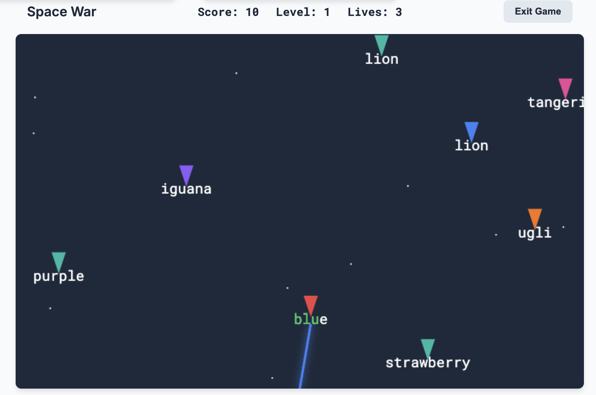
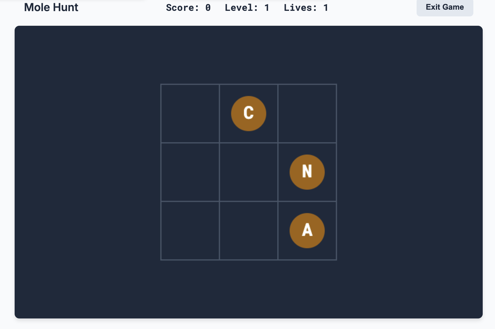
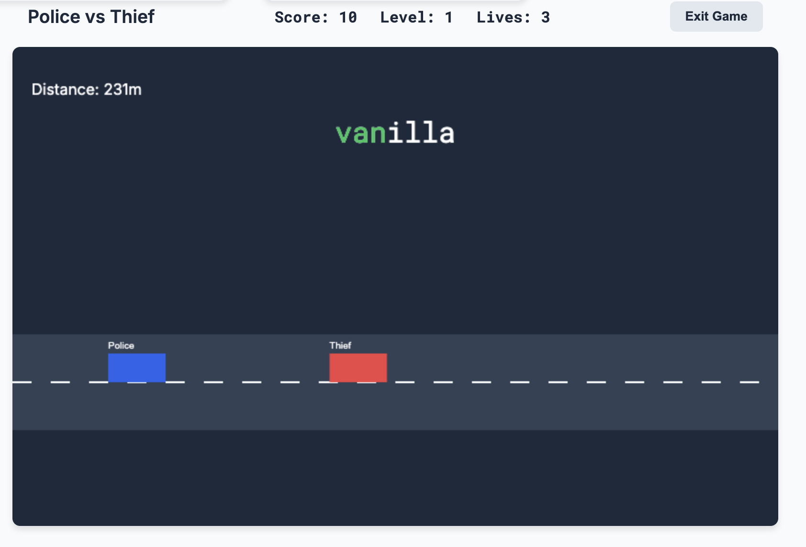
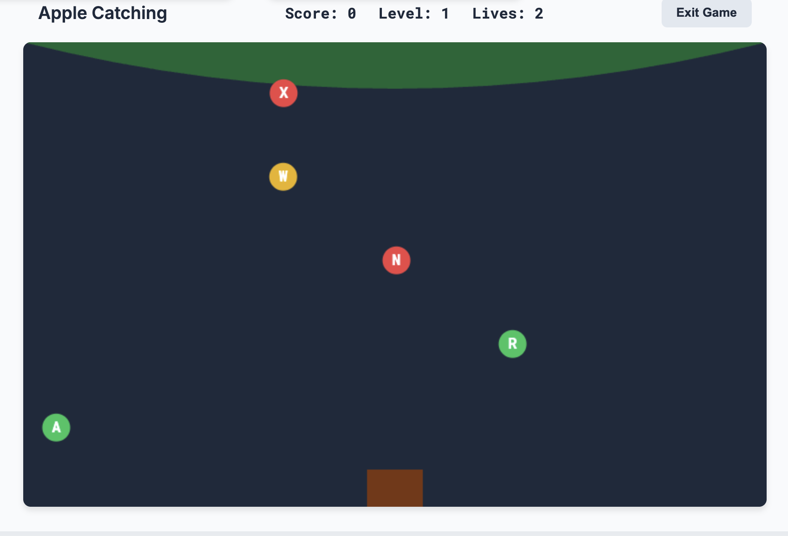
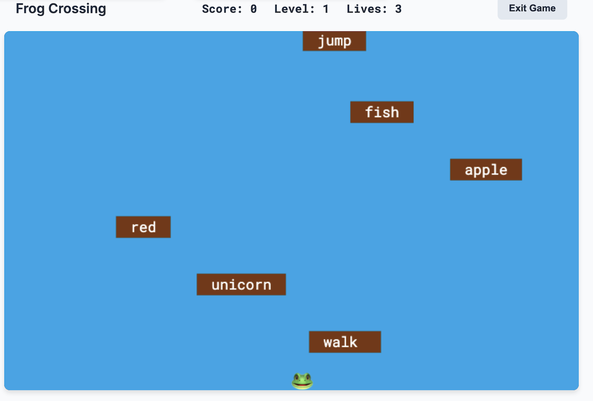

# AIDevLog 打字练习 (金山打字通 Clone)

<https://github.com/build-your-own-x-with-ai/AITyping>

一个受“AIDevLog 打字通”启发的现代 Web 打字练习应用。使用原生 HTML、CSS 和 JavaScript 构建。

## 功能特点

### 🎯 练习模式
- **实时反馈**：即时显示正确/错误的按键视觉提示。
- **数据统计**：实时追踪 WPM（每分钟字数）、准确率、时间和进度。
- **虚拟键盘**：带有按键高亮和**指法引导**（颜色编码的手指区域）的虚拟键盘。
- **粒子特效**：正确击键时会有令人满足的火花特效。
- **自定义文本**：支持上传 `.txt` 文件进行自定义内容练习。

### 🎮 游戏中心
包含 5 个有趣的打字游戏，让练习不再枯燥：

1.  **太空大战 (Space War)**：通过输入单词摧毁来袭的飞船。包含激光和爆炸特效。
2.  **打地鼠 (Mole Hunt)**：通过输入地鼠手中的字符来击打它们。
3.  **生死时速 (Police vs Thief)**：快速打字帮助警车抓住小偷。
4.  **吃苹果 (Apple Catching)**：在苹果腐烂前输入字母接住它们。
5.  **青蛙过河 (Frog Crossing)**：通过输入荷叶上的单词帮助青蛙过河。

### ✨ 视觉优化
- **动画效果**：流畅的页面切换、粒子特效和游戏动画。
- **主题设计**：干净、专业的“AIDevLog”风格蓝/白主题。
- **响应式设计**：适配不同屏幕尺寸。

## 如何运行

1.  克隆或下载此仓库。
2.  在任意现代浏览器中打开 `index.html`。
3.  开始打字练习！

## 截图预览

### 太空大战 (Space War)

### 打地鼠 (Mole Hunt)

### 生死时速 (Police vs Thief)

### 吃苹果 (Apple Catching)

### 青蛙过河 (Frog Crossing)

## 技术栈
- HTML5
- CSS3 (变量, 动画, Flexbox/Grid)
- JavaScript (ES6+)

---
*Created for AIDevLog*
